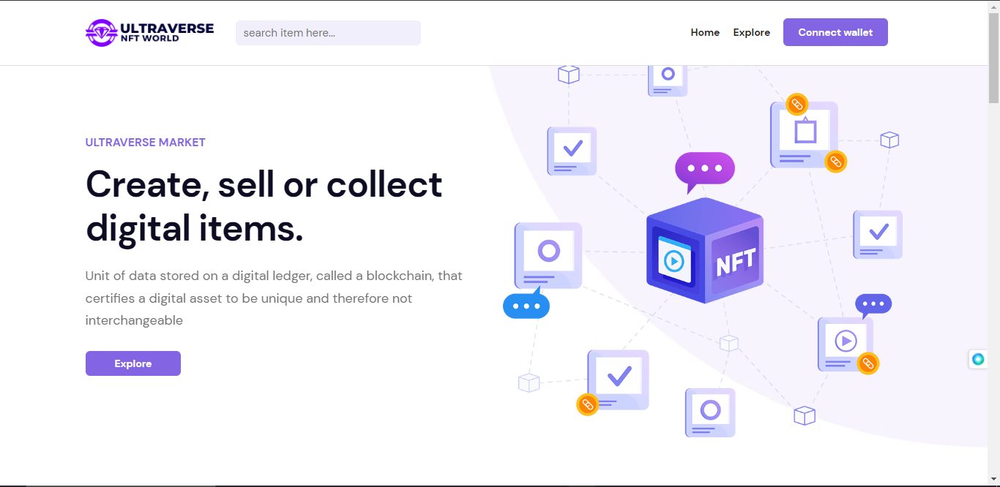

# Ultraverse - NFT MarketPlace

## Table of Contents

Ultraverse is a React-based NFT showcase platform that
offers creators a visually stunning and interactive tool
to display their artwork. Features like Animate on Scroll,
skeleton loading state, and React Slick Carousel provide a
seamless user experience.

## React

